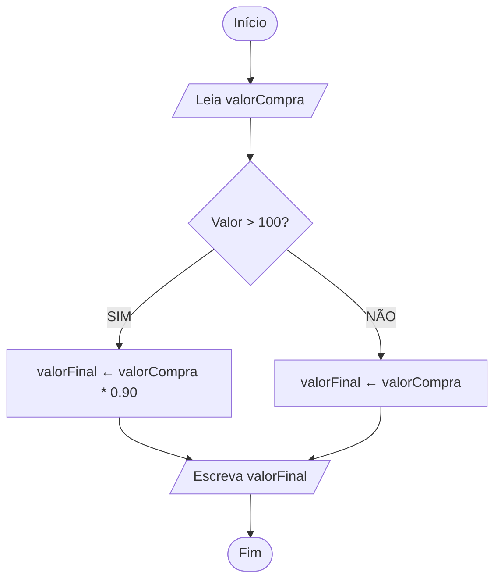

```mermaid
flowchart TD

A([Início]) --> B[/Leia valorCompra/]
B --> C{Valor > 100?}

C -- SIM --> D[valorFinal ← valorCompra * 0.90]
C -- NÃO --> E[valorFinal ← valorCompra]

D --> F[/Escreva valorFinal/]
E --> F

F --> G([Fim])
```